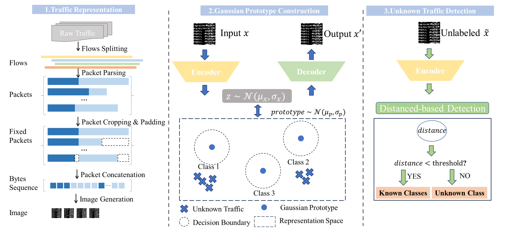
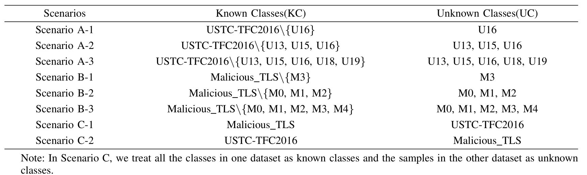

# Detection of Unknown Attacks: A Gaussian Prototype-Aided Variational Autoencoder Framework



**Overview of the Open-Detect framework for unknown network traffic detection.**


## 1.Dataset

The dataset in `data/data set`

You can download all the dataset from pan.baidu.com

 ```
 Open-Detect dataset:
 Link: https://pan.baidu.com/s/1DYSDeyLgDhMVHO2BAsR0aQ?pwd=8b8z 
 Extraction code: 8b8z
 ```


**8 scenarios:**




## 2.Usage

```python
python train.py

python test.py
```


## 3.Setups

- Python 3.10.13
- Pytorch 2.1.1
- numpy==1.26.1
- pandas==2.1.3