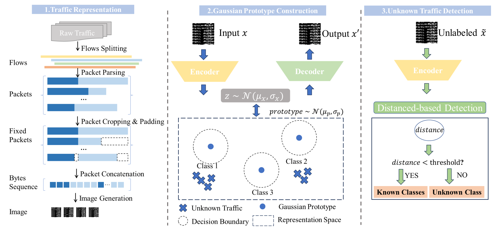

# Detection of Unknown Attacks Through Encrypted Traffic: A Gaussian Prototype-Aided Variational Autoencoder Framework
IEEE TIFS 2025 ([https://ieeexplore.ieee.org/document/11173980](https://ieeexplore.ieee.org/document/11173696))

---

### Abstract

The identification of encrypted network traffic presents a pivotal challenge in detecting unknown malicious traffic. Unlike closed-set identification, which primarily classifies known traffic classes, detecting unknown malicious traffic necessitates both accurate classification of known traffic and the identification of previously unseen traffic classes. Existing methods often face difficulties in effectively constraining the distribution size of known classes in the representation space and frequently misclassifying unknown classes as known. To address these challenges, we propose Open-Detect, a robust theoretical framework for detecting unknown malicious traffic, which leverages advanced deep learning techniques, such as variational autoencoders and Gaussian prototypes. Open-Detect introduces two primary constraints: a generative constraint, which enhances intra-class compactness, and a discriminative constraint, which optimizes inter-class separation. These constraints collectively mitigate the risks of misclassifying known classes and failing to detect unknown classes. In Open-Detect, network flows are transformed into grayscale images, and each known traffic class is mapped to a unique Gaussian prototype in the latent space. This design ensures tight clustering of samples within the same class and clear separation of samples between different classes. The detection of unknown malicious traffic is performed based on the distance between samples and these prototypes. Extensive experiments conducted on multiple publicly available datasets substantiate the efficacy of Open-Detect. The results reveal significant improvements in intra-class compactness and inter-class separation, enabling superior performance in both closed-world and open-world scenarios, particularly for detecting unknown malicious traffic. 


*Overview of the Open-Detect framework for unknown network traffic detection.*

---

## Table of Contents

- [Features](#features)
- [Dataset](#dataset)
- [Quickstart](#quickstart)
- [Usage](#usage)
- [Project Structure](#project-structure)
- [Setup & Installation](#setup--installation)
- [Model Details](#model-details)
- [Results & Scenarios](#results--scenarios)

---

## Features

- **Unknown Attack Detection:** Detects both known and unknown attacks using latent Gaussian prototypes.
- **Ready-to-Run Scripts:** Includes training and evaluation scripts.

---

## Dataset

The dataset used for experiments is located in `data/dataset`.  
It contains network traffic from **8 different scenarios**, simulating a range of attack and normal behaviors.

You can download the dataset from Baidu Cloud:

```
Open-Detect dataset:
Link: https://pan.baidu.com/s/1DYSDeyLgDhMVHO2BAsR0aQ?pwd=8b8z 
Extraction code: 8b8z
```

**Scenarios included:**


Each scenario contains labeled traffic data for both benign and attack samples. The dataset is organized for easy integration with provided scripts.

---

## Quickstart

### 1. Clone the repository

```bash
git clone https://github.com/niebikong/Open-Detect.git
cd Open-Detect
```

### 2. Download the dataset

Download and extract the dataset as described above. Place the files in `data/dataset`.

### 3. Install requirements

See [Setup & Installation](#setup--installation) for details.

---

## Usage

### Training

To train the Open-Detect model on your dataset:

```python
python train.py
```

### Testing / Evaluation

To evaluate the model (including detection of unknown attacks):

```python
python test.py
```

---

## Project Structure

```
Open-Detect/
│
├── data/
│   └── dataset/            # Downloaded network traffic data
│   └── Preprocessing/      # Transform raw pcap file to grayscale images
├── save_model/             # Trained mdoel
├── model/                  # The Open-Detect model(Resnet18)
├── train.py                # Training script
├── test.py                 # Evaluation script
├── utils.py                # Utilities
├── README.md               # Project documentation
```

---

## Setup & Installation

- **Python:** 3.10.13
- **PyTorch:** 2.1.1
- **NumPy:** 1.26.1
- **Pandas:** 2.1.3

Install dependencies (use a virtual environment for best results):

```python
pip install torch==2.1.1 numpy==1.26.1 pandas==2.1.3
```

---

## Model Details

The core model is a **Gaussian Prototype-Aided Variational Autoencoder (Open-Detect)**.  
Key characteristics:

- **Encoder/Decoder:** Learns compact representations of network traffic.
- **Gaussian Prototypes:** Each class (including unknown) is represented by a latent Gaussian, aiding unknown traffic recognition.
- **Novelty Detection:** Samples far from known prototypes are flagged as unknown.

For more technical details, see the code in `model.py`.

---

## Results & Scenarios

The framework is evaluated across 8 scenarios, including multiple attack types.  
Performance metrics, confusion matrices, and ROC curves can be generated using the test script.

---

## Citation

```
@article{meng2025detection,
  title={Detection of Unknown Attacks Through Encrypted Traffic: A Gaussian Prototype-Aided Variational Autoencoder Framework},
  author={Meng, Qianwei and Tao, Jing and Yuan, Qingjun and Li, Guangsong and Wang, Yongjuan and Gao, Bing and Lu, Siqi},
  journal={IEEE Transactions on Information Forensics and Security},
  year={2025},
  publisher={IEEE}
}
```

---

**For any questions, please open an issue or contact the authors.**
